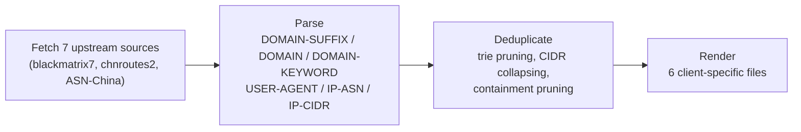

[](https://github.com/Mr-Grin/china-direct-rules/actions/workflows/update.yml)

# china-direct-rules

**A single, deduplicated, daily-refreshed direct-connect ruleset for mainland China traffic.**

Merges [blackmatrix7/ios_rule_script](https://github.com/blackmatrix7/ios_rule_script) (`China`, `ChinaMax`, `ChinaIPs`), [misakaio/chnroutes2](https://github.com/misakaio/chnroutes2) (BGP-sourced China IP ranges), and [missuo/ASN-China](https://github.com/missuo/ASN-China) (China-registered ASNs) into one canonical set, then renders it for **Shadowrocket, Surge, Loon, QuantumultX, and Clash**.

---

## Subscribe

Pick your client, paste the URL, set the subscription's refresh interval to 24h so it stays current.

| Client | URL |
|---|---|
| **Shadowrocket** (module, recommended) | `https://raw.githubusercontent.com/Mr-Grin/china-direct-rules/main/rules/shadowrocket.sgmodule` |
| **Shadowrocket** (raw rule) | `https://raw.githubusercontent.com/Mr-Grin/china-direct-rules/main/rules/shadowrocket.list` |
| **Surge** | `https://raw.githubusercontent.com/Mr-Grin/china-direct-rules/main/rules/surge.list` |
| **Loon** | `https://raw.githubusercontent.com/Mr-Grin/china-direct-rules/main/rules/loon.list` |
| **QuantumultX** | `https://raw.githubusercontent.com/Mr-Grin/china-direct-rules/main/rules/quantumultx.list` |
| **Clash** | `https://raw.githubusercontent.com/Mr-Grin/china-direct-rules/main/rules/clash.yaml` |

<details>
<summary><b>Setup instructions per client</b></summary>
<br>

**Shadowrocket — module (recommended)**
Configuration → **Module** → **+** → paste the `.sgmodule` URL → Download. Toggle the whole module on/off from the Module list; no manual config editing.

**Shadowrocket — manual rule**
Add to a profile's `[Rule]` section:
```
RULE-SET,<the .list URL above>,DIRECT
```

**Surge**
Add to `[Rule]`:
```
RULE-SET,<the URL above>,DIRECT
```

**Loon — remote rule (recommended)**
Configuration → **Rule** → **+** → paste the URL, set an alias, choose policy **DIRECT** → Save.

**Loon — manual rule**
Add to `[Rule]`:
```
RULE-SET,<the URL above>,DIRECT
```

**QuantumultX**
Add to `[filter_remote]`:
```
<the URL above>, tag=china-direct, enabled=true
```
The policy is already baked into the file, so no `force-policy=` override is needed.

**Clash**
Needs a `rule-providers` block rather than a one-liner:
```yaml
rule-providers:
  china-direct:
    type: http
    behavior: classical
    url: "<the .yaml URL above>"
    path: ./ruleset/china-direct.yaml
    interval: 86400
rules:
  - RULE-SET,china-direct,DIRECT
```

</details>

## Rule statistics

<!-- RULE-STATS:START -->

| Type | Count |
|---|---|
| DOMAIN-SUFFIX | 112,513 |
| DOMAIN | 0 |
| DOMAIN-KEYWORD | 14 |
| USER-AGENT | 51 |
| IP-ASN | 5,231 |
| IP-CIDR (v4) | 8,270 |
| IP-CIDR6 (v6) | 4,108 |
| **TOTAL** | **130,187** |

<!-- RULE-STATS:END -->

Auto-updated by [`scripts/build_rules.py`](scripts/build_rules.py) every run; reflects the canonical merged set (Clash's output additionally drops `USER-AGENT` rows — see [output files](#output-files)).

## How it's built

All six client files are generated from **one canonical rule set** by [`scripts/build_rules.py`](scripts/build_rules.py) — nothing is fetched or maintained separately per client.



**1. Fetch & parse** the sources listed under [why these sources](#why-these-sources), reading every rule type each one defines.

**2. Deduplicate** — not just exact-line matches:

| Rule type | Dedup strategy |
|---|---|
| `DOMAIN-SUFFIX` | Built into a trie; a suffix already covered by a shorter one in the set is pruned (e.g. `doh.360.cn` under `cn`). |
| `IP-CIDR` | Merged per IP version with `ipaddress.collapse_addresses`, which also drops CIDRs that are subsets of a larger included block. |
| `DOMAIN` / `IP-ASN` | Exact-value dedup. `DOMAIN` entries already covered by a kept `DOMAIN-SUFFIX` are dropped too. |
| `DOMAIN-KEYWORD` / `USER-AGENT` | Exact-value dedup **plus** containment pruning — if one pattern's matches are a provable subset of another's, the narrower one is dropped (e.g. keyword `qiyi` makes `iqiyi` redundant; `USER-AGENT,QQ*` makes `QQMusic*` redundant). Wildcards are modeled as anchored glob patterns so this only fires when safe; a bare `?` wildcard opts a pattern out entirely. |
| IPv4-mapped IPv6 | Upstream `ChinaMax.list` writes 29 addresses as `::ffff:a.b.c.d/128`, which never match real IPv4 connections in any client. These are converted back to plain IPv4 `/32` before collapsing. |

**3. Render** the deduplicated set into each client's syntax:

### Output files

| File | Client | Notes |
|---|---|---|
| `rules/shadowrocket.list` | Shadowrocket | `RULE-SET`; IPv4 and IPv6 CIDRs share one `IP-CIDR` type |
| `rules/shadowrocket.sgmodule` | Shadowrocket | Module wrapping a `RULE-SET` reference to `shadowrocket.list`, addable from Configuration → Module |
| `rules/surge.list` | Surge | `RULE-SET`; IPv6 CIDRs use a separate `IP-CIDR6` type |
| `rules/loon.list` | Loon | Same syntax as Surge |
| `rules/quantumultx.list` | QuantumultX | Uses `HOST`/`HOST-SUFFIX`/`HOST-KEYWORD`/`IP6-CIDR`; every line carries an explicit `direct` policy so it works standalone |
| `rules/clash.yaml` | Clash | `behavior: classical` rule-provider; **`USER-AGENT` rules are dropped** — classical mode has no such rule type |

blackmatrix7's per-client directories are ~99% the same data with different serialization; a few platform-exclusive extras (QuantumultX's one `HOST-WILDCARD` rule, Surge/Clash's desktop-only `PROCESS-NAME` rules) aren't reproduced here. Trade-off: one build pipeline and guaranteed-identical domain/IP coverage across every client, at the cost of a handful of rarely-relevant platform-specific micro-rules.

## Automation

[`.github/workflows/update.yml`](.github/workflows/update.yml) runs daily at **21:30 UTC / 05:30 Beijing** — a few hours after upstream's own daily refresh:

1. Regenerates all six output files.
2. Discards any file whose only change is the `# UPDATED:` timestamp, so no-op days produce no commit.
3. Commits and pushes only the files that actually changed.

Trigger a run manually anytime from the **Actions** tab (`workflow_dispatch`).

## Why these sources

<details>
<summary>Diffing four candidate China rulesets to decide what's actually worth merging</summary>
<br>

Diffing the China-related rulesets (`China`, `ChinaIPs`, `ChinaIPsBGP`/`chnroutes.txt`, `ChinaMax`) showed:

- **`chnroutes.txt`** is fetched directly from misakaio's [chnroutes2](https://github.com/misakaio/chnroutes2) rather than blackmatrix7's `ChinaIPsBGP.list` mirror, since that mirror lags live upstream by weeks. It's currently a 100% address-space subset of `ChinaMax` — zero unique addresses today — but it's kept anyway since `collapse_cidrs()` dedupes it for free, and it guards against BGP churn landing a route here before `ChinaMax` picks it up.
- **`ChinaIPs`** is ~99.93% overlapping with `ChinaMax`, but the remaining ~0.07% (≈247k addresses) is real unique address space that `collapse_cidrs()` merges for free — so it's included.
- **`China`** (the small curated list) contributes real value `ChinaMax` doesn't have: 5 Tencent Cloud HK/SG IP ranges used by WeChat/QQ backends, a `microsoft` `DOMAIN-KEYWORD`, and ~162 domains (`bootcdn.net`, `baidustatic.com`, `51.la`, etc.) missing from `ChinaMax`.
- blackmatrix7's lists carry only one hand-picked `IP-ASN` entry between them, so [missuo/ASN-China](https://github.com/missuo/ASN-China)'s `ASN.China.list` — a comprehensively scraped, independently refreshed registry of thousands of China-registered ASNs — is merged in too. It uses `//` comments rather than blackmatrix7's `#`-only convention, which the parser accounts for.

**Result:** `China.list` + `China_Domain.list` + `ChinaMax.list` + `ChinaMax_Domain.list` + `ChinaIPs.list` + `chnroutes.txt` + `ASN.China.list` merged into the canonical set.

</details>
